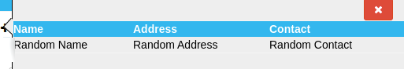

# vuejs-popup
A customizable popup for Vue Js

## Props
Following props can be passed to this component.

`icon` ==> Can be passed a fontawesome class, eg, fa-caret
## Installation
`npm i vuejs-popup `

## Usage
* import the component globally or locally.
  
  `import popup from "vuejs-popup";`
* Use the component as:
  
``` html
<popup icon="fa-plus">
        <template v-slot:default>
            //place your contents here.
        </template>
</popup>
```
## Example
``` html
        <popup icon="fa-plus">
            <table class="table table-bordered">
              <tr>
                <th>Name</th>
                <th>Address</th>
                <th>Contact</th>
              </tr>
              <tr>
                <td>Random Name</td>
                <td>Random Address</td>
                <td>Random Contact</td>
              </tr>
            </table>
        </popup>
```
## Preview

